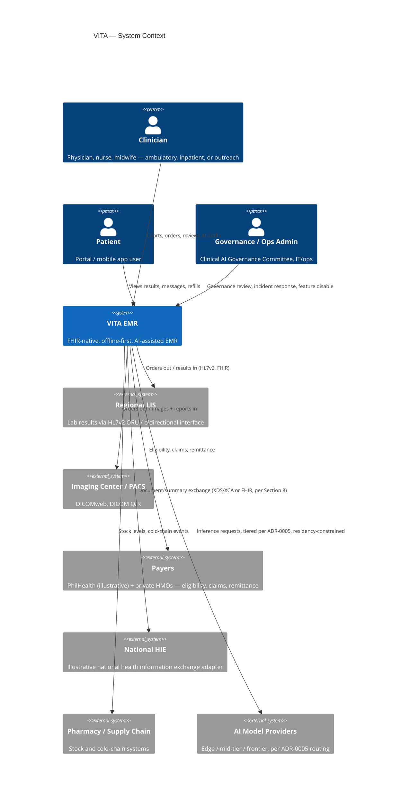
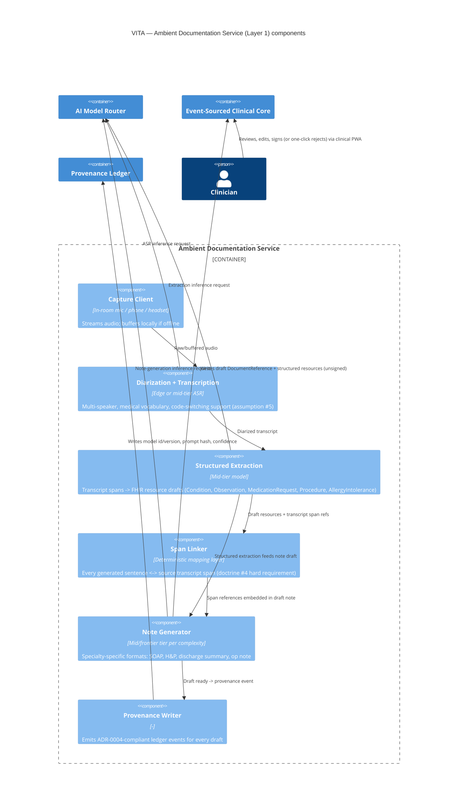

# C4 Architecture Diagrams

Rendered in Mermaid. These reflect the ADRs in `adr/` — in particular the
event-sourced core (ADR-0002), CRDT edge sync (ADR-0003/0009), the
provenance ledger (ADR-0004), tiered AI routing (ADR-0005), CDS Hooks
delivery (ADR-0006), the terminology service (ADR-0007), and schema-per-
tenant multi-tenancy (ADR-0008).

## Level 1 — System Context

## Level 2 — Containers

```mermaid
C4Container
    title VITA — Containers

    Person(clinician, "Clinician")
    Person(patient, "Patient")

    System_Boundary(vita, "VITA EMR") {
        Container(pwa, "Clinical PWA / Mobile", "Offline-capable PWA + native shell", "Tablet/phone client; local-first store per ADR-0003")
        Container(portal, "Patient Portal / App", "PWA", "Results, messaging, scheduling, refills")

        Container(edge, "Edge Appliance", "On-prem, low-power node", "Runs the same core stack locally for disconnectable facilities, per ADR-0009")

        Container(gateway, "API Gateway", "FHIR REST + GraphQL + Bulk FHIR + CDS Hooks + SMART on FHIR", "Everything the UI does, the API does (Section 8)")

        Container(eventcore, "Event-Sourced Clinical Core", "Append-only event log + FHIR-resource projections", "System of record, per ADR-0001/0002")
        Container(sync, "CRDT Sync Engine", "Clinically-tiered conflict resolution", "Per ADR-0003")
        Container(provenance, "Provenance Ledger", "Typed extension of the event log", "Per ADR-0004")
        Container(terminology, "Terminology Service", "SNOMED/LOINC/RxNorm-equiv/ICD/local codes", "Per ADR-0007")

        Container(router, "AI Model Router", "Edge / mid / frontier tiers", "Per ADR-0005")
        Container(ambient, "Ambient Documentation Service", "Layer 1", "Diarized transcription -> structured FHIR draft")
        Container(retrieval, "Chart Intelligence Service", "Layer 2", "Hybrid semantic+lexical retrieval, cited answers only")
        Container(cds, "CDS Hooks Services", "Layer 3, shadow-mode at launch per ADR-0010", "Interaction/dose/deterioration/guideline rules")
        Container(agents, "Agentic Ops Services", "Layer 4", "Prior auth, coding, denials, inbox triage — human approval gate on money/patient actions")

        ContainerDb(control, "Multi-Tenant Control Plane", "Tenant provisioning, per-tenant keys", "Per ADR-0008")
    }

    System_Ext(external, "External Systems", "LIS, imaging, payers, HIE, pharmacy")

    Rel(clinician, pwa, "Uses")
    Rel(patient, portal, "Uses")
    Rel(pwa, edge, "Syncs when local edge appliance present")
    Rel(pwa, gateway, "FHIR/GraphQL, when connected")
    Rel(portal, gateway, "FHIR/GraphQL")
    Rel(edge, gateway, "Reconciles on reconnect via CRDT sync")

    Rel(gateway, eventcore, "Reads/writes FHIR resources")
    Rel(gateway, cds, "CDS Hooks invocations")
    Rel(gateway, external, "HL7v2 / FHIR / DICOMweb / X12-equivalent")

    Rel(eventcore, sync, "Offline-authored events reconciled through")
    Rel(eventcore, provenance, "Every AI-authored event tagged into")
    Rel(eventcore, terminology, "Validates codes against")
    Rel(eventcore, control, "Partitioned per tenant")

    Rel(ambient, router, "Requests inference")
    Rel(retrieval, router, "Requests inference")
    Rel(cds, router, "Requests inference")
    Rel(agents, router, "Requests inference")

    Rel(ambient, eventcore, "Writes draft FHIR resources (Condition, Observation, MedicationRequest...)")
    Rel(retrieval, eventcore, "Reads for cited chart answers")
    Rel(cds, eventcore, "Reads for rule evaluation")
    Rel(agents, eventcore, "Reads/writes with human-approval gate")
```

## Level 3 — Component view: Ambient Documentation Service (Layer 1)

Chosen as the component-level detail example because it's the doctrine #1
capability ("the record writes itself") and the one with the tightest
latency budget (20s note-draft-ready, Section 10).

